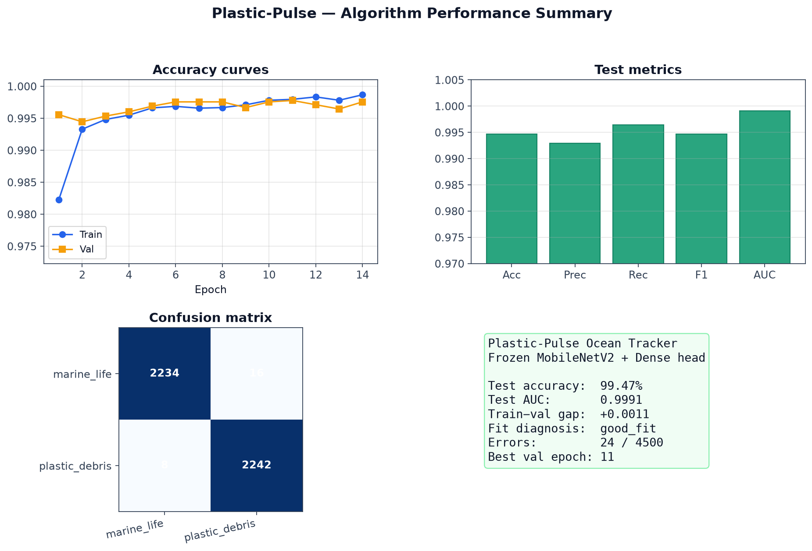
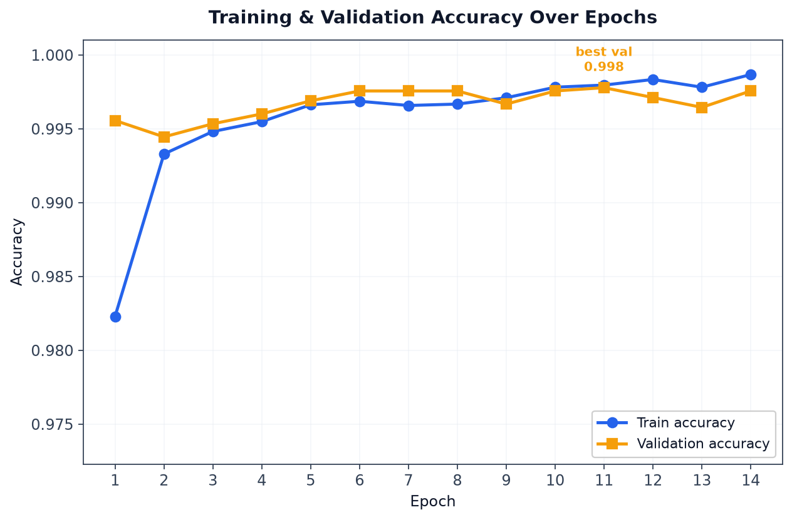
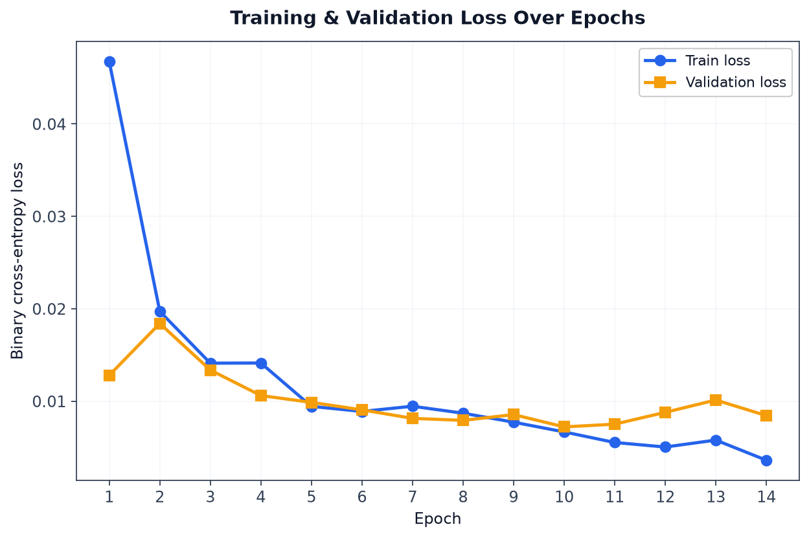
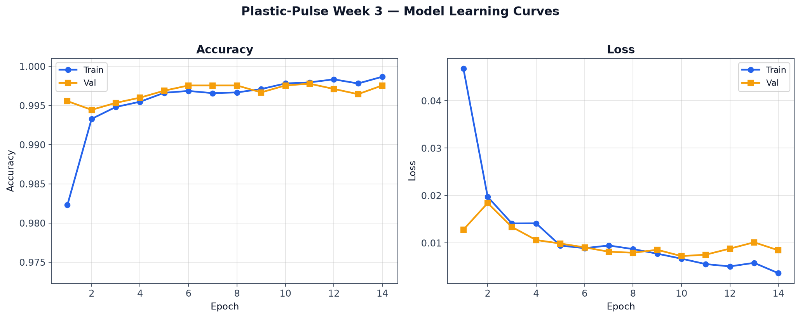
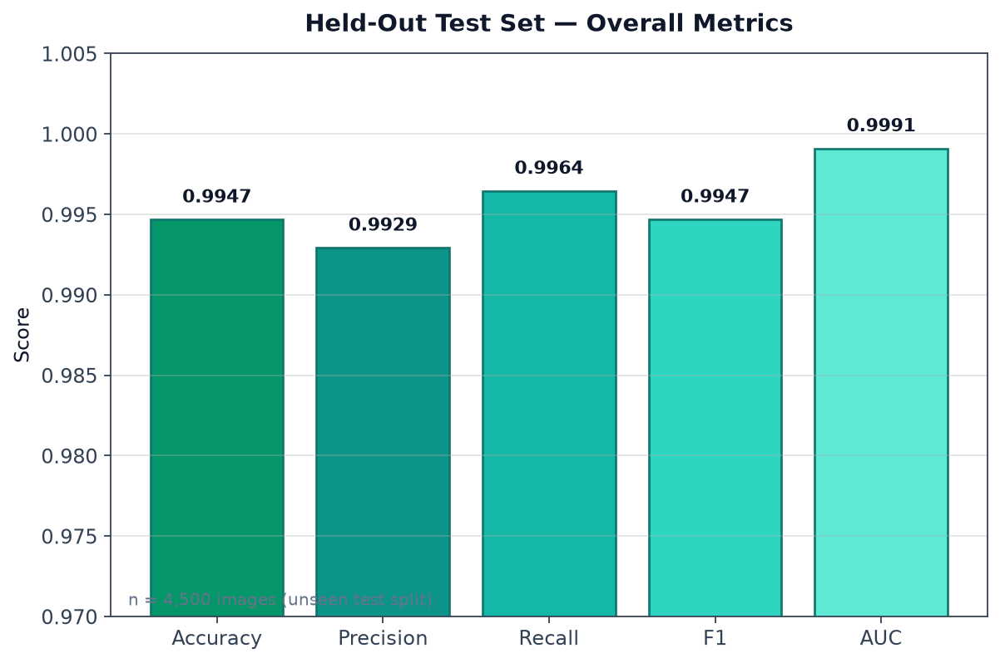
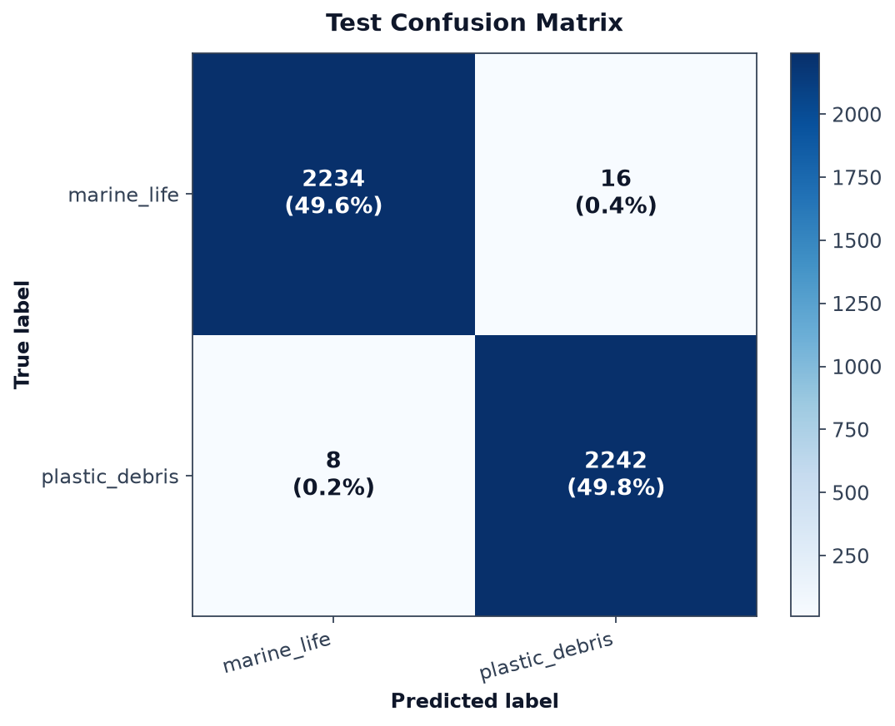
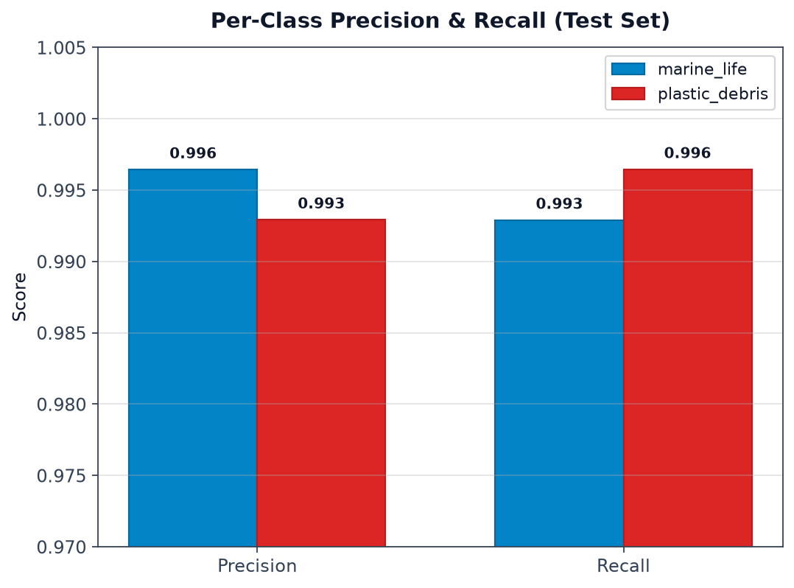
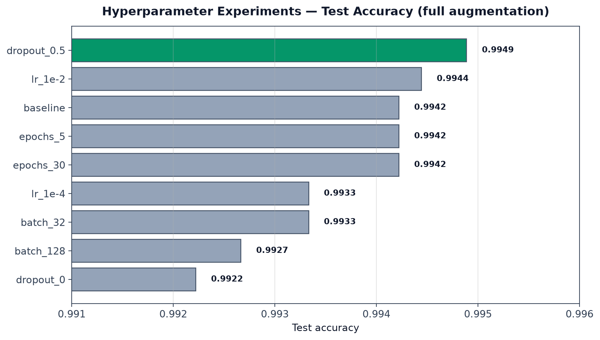
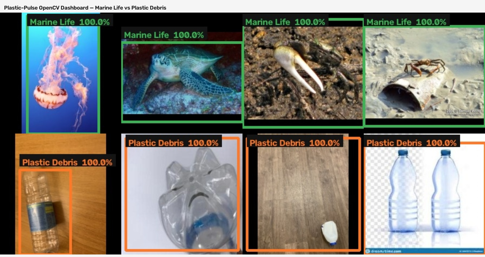

# Plastic-Pulse Ocean Tracker
## Internship Progress Summary — Weeks 1–4

**Project:** Binary computer-vision classifier for **Marine Life vs Plastic Debris**  
**Repository:** [github.com/guhankarthick2/Plastic-Pulse-Ocean-Tracker](https://github.com/guhankarthick2/Plastic-Pulse-Ocean-Tracker)  
**Branch:** `master` (through `2c3611d`)  
**Stack:** Python, TensorFlow/Keras, MobileNetV2 (ImageNet), Kaggle-sourced imagery

---

### Executive summary

The goal of this 4-week internship is a lightweight image classifier that can tell **living marine animals** from **plastic debris**, so ocean-monitoring drones can clean waste without harming wildlife.

**Weeks 1–4 are complete.** A balanced 5,000-image curated set was cleaned, resized, and augmented into a 30,000-image training-ready dataset. A transfer-learning model was built with a **frozen MobileNetV2** feature extractor and a **custom binary Dense head**, then **trained and tuned** (**100% train** / **99.38% test** after Week 4 retrain). **OpenCV integration** draws bounding boxes with labels and confidence on unseen test images (8/8 correct in the demo batch).

| Week | Focus | Status |
|------|--------|--------|
| 1 | Data foundations, pre-processing, augmentation | **Done** |
| 2 | Frozen pretrained backbone + custom classification head | **Done** |
| 3 | Training, evaluation, overfitting check | **Done** |
| 4 | Demo / deployment polish | **Done** |

---

### Submission links

| Deliverable | Link |
|-------------|------|
| **Code (repo)** | https://github.com/guhankarthick2/Plastic-Pulse-Ocean-Tracker |
| **Classifier architecture** | https://github.com/guhankarthick2/Plastic-Pulse-Ocean-Tracker/blob/master/models/classifier.py |
| **This progress document** | https://github.com/guhankarthick2/Plastic-Pulse-Ocean-Tracker/blob/master/docs/PROGRESS_SUMMARY.md |
| **Week 2 architecture page** | https://github.com/guhankarthick2/Plastic-Pulse-Ocean-Tracker/blob/master/outputs/week2/present.html |
| **Week 3 training report** | https://github.com/guhankarthick2/Plastic-Pulse-Ocean-Tracker/blob/master/outputs/week3/WEEK3_REPORT.md |
| **Week 3 experiments** | https://github.com/guhankarthick2/Plastic-Pulse-Ocean-Tracker/blob/master/outputs/week3/experiments/EXPERIMENT_REPORT.md |
| **Week 3 presentation** | https://github.com/guhankarthick2/Plastic-Pulse-Ocean-Tracker/blob/master/outputs/week3/present.html |
| **Performance dashboard graph** | https://github.com/guhankarthick2/Plastic-Pulse-Ocean-Tracker/blob/master/outputs/week3/presentation/graph_summary_dashboard.png |
| **Data (augmented training set)** | [GitHub Release zip](https://github.com/guhankarthick2/Plastic-Pulse-Ocean-Tracker/releases/download/week1-augmented-dataset/PlasticPulse_augmented_dataset.zip) · [release page](https://github.com/guhankarthick2/Plastic-Pulse-Ocean-Tracker/releases/tag/week1-augmented-dataset) |
| **Live demo recording** | Recorded separately by the intern |

---

## Week 1 — Data Foundations & Image Pre-processing

**Focus:** Prepare raw visual data so a model can learn Marine Life vs Plastic Debris.

### What was delivered

A **balanced binary dataset**, cleaned to a common size, with flip/rotation variants for robustness:

| Stage | `marine_life` | `plastic_debris` | Total |
|-------|---------------:|------------------:|------:|
| Curated raw | 2,500 | 2,500 | **5,000** |
| Processed (224×224 JPEG) | 2,500 | 2,500 | **5,000** |
| Augmented training set | 15,000 | 15,000 | **30,000** |

Pipeline scripts:

- `scripts/curate_dataset.py` — download/filter Kaggle sources, write a balanced raw set
- `scripts/preprocess_and_augment.py` — resize, QA-normalize, augment
- `scripts/run_week1.py` — run both steps end-to-end

Notebook: `notebooks/week1_data_foundations.ipynb`

### Sources (Kaggle)

Images were curated from public Kaggle datasets (licenses remain with the original authors). Counts below are the images **kept** in the balanced 2,500-per-class raw set.

**Marine life** (2,500 images from 13,936 unique candidates)

| Dataset | Kept | URL |
|---------|-----:|-----|
| Sea Animals Image Dataset | 2,342 | [vencerlanz09/sea-animals-image-dataste](https://www.kaggle.com/datasets/vencerlanz09/sea-animals-image-dataste) |
| Marine Animal Images | 158 | [mikoajfish99/marine-animal-images](https://www.kaggle.com/datasets/mikoajfish99/marine-animal-images) |

**Plastic debris** (2,500 images from 4,503 unique plastic-class candidates)

| Dataset | Kept | URL |
|---------|-----:|-----|
| Drinking Waste Classification (PET / HDPE) | 1,516 | [arkadiyhacks/drinking-waste-classification](https://www.kaggle.com/datasets/arkadiyhacks/drinking-waste-classification) |
| Garbage Images Dataset (plastic class) | 818 | [zlatan599/garbage-dataset-classification](https://www.kaggle.com/datasets/zlatan599/garbage-dataset-classification) |
| Garbage Classification / TrashNet (plastic class) | 166 | [asdasdasasdas/garbage-classification](https://www.kaggle.com/datasets/asdasdasasdas/garbage-classification) |

Two additional marine-debris listings were checked (`jocelyndumlao/seaclear-marine-debris-detection-and-segmentation`, `sovitrath/marine-debris-dataset`) and contributed **0** images after filename/class filters, so the plastic class was filled from the three garbage/plastic sources above.

### Pre-processing

| Step | Implementation |
|------|----------------|
| Color | Convert to RGB |
| Resize | **224×224** with aspect-preserving pad (black letterbox) so subjects are not stretched |
| On-disk format | JPEG (quality 92) for the large training set |
| Normalization | Pixel values mapped to **[0, 1]** by dividing by 255 when loading; verified with 25 `.npy` QA samples per class (`pixel_min = 0.0`, `pixel_max = 1.0`) |

### Augmentation (6 variants per source image)

Each processed image produced:

1. Original  
2. Horizontal flip  
3. Vertical flip  
4. Rotate +15°  
5. Rotate −15°  
6. Rotate +30°

That is **6 × 2,500 = 15,000** images per class (**30,000** total). Filenames keep the source stem plus a suffix, e.g. `image123__hflip.jpg`.

### Local data layout (not committed to GitHub)

```text
data/
  raw/          2,500 / class   curated originals
  processed/    2,500 / class   224×224 cleaned
  augmented/   15,000 / class   training-ready set  ← share this
```

Manifests:

- `outputs/week1_data_sources.json` — per-source counts and URLs  
- `outputs/week1_dataset_summary.json` — class counts, size, normalization notes  

Reproduce locally (requires a Kaggle API token at `%USERPROFILE%\.kaggle\kaggle.json`):

```powershell
cd Plastic-Pulse-Ocean-Tracker
.\.venv\Scripts\Activate.ps1
pip install -r requirements.txt
python scripts/run_week1.py
```

---

## Week 2 — Pretrained Feature Extractor + Custom Head

**Focus:** Transfer learning — reuse ImageNet visual features, train only a small binary head for this ocean task.

### What was delivered

A compiled TensorFlow/Keras model:

- **Backbone:** MobileNetV2, ImageNet weights, `include_top=False`
- **Feature extractor:** **frozen** (`trainable = False`)
- **Task:** binary classification  
  - `0` = `marine_life`  
  - `1` = `plastic_debris`
- **Output:** sigmoid probability of plastic debris

Code: [`models/classifier.py`](https://github.com/guhankarthick2/Plastic-Pulse-Ocean-Tracker/blob/master/models/classifier.py)  
Build: `python scripts/build_model.py --backbone mobilenetv2 --save`  
Notebook: `notebooks/week2_model_architecture.ipynb`  
Browser summary: [`outputs/week2/present.html`](https://github.com/guhankarthick2/Plastic-Pulse-Ocean-Tracker/blob/master/outputs/week2/present.html)

### Architecture

```text
Input (224×224×3)
  → Lambda  MobileNetV2 preprocess
  → MobileNetV2 backbone          [FROZEN]
  → GlobalAveragePooling2D
  → Dropout (0.3)
  → Dense(128, ReLU)              [TRAINABLE]
  → Dropout (0.3)
  → Dense(1, sigmoid)             [TRAINABLE]
```

The backbone maps an image to a 7×7×1280 feature map. Global average pooling collapses that to a 1280-D vector. The custom head then predicts a single plastic-debris probability.

### Parameters

| | Count | Role |
|--|------:|------|
| **Total** | 2,422,081 (9.24 MB) | Full graph |
| **Trainable** | 164,097 (641 KB) | Custom head only (`Dense(128)` + `Dense(1)`) |
| **Frozen / non-trainable** | 2,257,984 (8.61 MB) | ImageNet MobileNetV2 |

Trainable parameters are **~6.8%** of the model. That is intentional: on a 30k-image set, freezing the backbone reduces overfitting and keeps Week 3 training fast.

### Compilation

| Setting | Value |
|---------|--------|
| Optimizer | Adam (`lr = 1e-3`) |
| Loss | `binary_crossentropy` |
| Metrics | accuracy, precision, recall, AUC |

### Artifacts

| File | Purpose |
|------|---------|
| `models/saved/PlasticPulse_mobilenetv2_classifier.keras` | Compiled untrained model (gitignored) |
| `outputs/week2/PlasticPulse_mobilenetv2_classifier_summary.txt` | Keras `model.summary()` |
| `outputs/week2/PlasticPulse_mobilenetv2_classifier_architecture.json` | Layer/param metadata |
| `outputs/week2/week2_model_build.json` | Build record |
| `outputs/week2/present.html` | Browser-ready architecture page |

A ResNet50 backbone is implemented in the same factory (`--backbone resnet50`) but **MobileNetV2 is the submitted Week 2 model** (smaller, drone-friendly).

### Training-load note (for Week 3)

Augmented JPEGs are stored as uint8 RGB. The model’s Lambda layer runs official MobileNetV2 preprocess (scale to `[-1, 1]` from 0–255). **Do not divide by 255 before `model.predict` / `fit`.** The `/255` path is for dataset QA and any custom loaders that expect `[0, 1]` tensors.

---

## Dataset link

The training images are **not** on GitHub (too large; `.gitignore` excludes `data/augmented/`).

**Share this folder:** `data/augmented/`  
**Packaged zip:** `outputs/share/PlasticPulse_augmented_dataset.zip`  
**Approximate size:** 362 MB · **30,000** JPEGs (15,000 per class)

Contents of the zip:

```text
README.md
augmented/marine_life/*.jpg       # label 0
augmented/plastic_debris/*.jpg    # label 1
```

**Published download URL:**

- Release page: https://github.com/guhankarthick2/Plastic-Pulse-Ocean-Tracker/releases/tag/week1-augmented-dataset
- Direct zip: https://github.com/guhankarthick2/Plastic-Pulse-Ocean-Tracker/releases/download/week1-augmented-dataset/PlasticPulse_augmented_dataset.zip

Rebuild the zip locally:

```powershell
python scripts/package_dataset.py
```

---

## Week 3 — Train, Monitor, Evaluate

**Focus:** Train the custom head on the Week 1 dataset, monitor curves, evaluate on unseen test images, diagnose fit.

### Split (stem-level — no augmentation leakage)

| Split | Stems | Images | Balance |
|-------|------:|-------:|---------|
| Train | 3,500 | 21,000 | 10,500 / 10,500 |
| Val | 750 | 4,500 | 2,250 / 2,250 |
| Test | 750 | 4,500 | 2,250 / 2,250 |

All 6 variants of a source image stay in the same split.

### Training setup

- Frozen MobileNetV2 features cached once, then Dense head trained (equivalent to end-to-end fit with frozen backbone)
- Adam `1e-3`, binary cross-entropy, **dropout 0.5** (tuned via experiments)
- EarlyStopping on `val_loss` (patience 4) + ReduceLROnPlateau
- **14 epochs ran** (requested 20); **best weights restored** by early stopping

### Performance graphs

Regenerate: `python scripts/generate_presentation_graphs.py` · Full page: [`outputs/week3/present.html`](../outputs/week3/present.html)

#### Dashboard (one-slide overview)



#### Training & validation accuracy / loss

| | Accuracy | Loss |
|--|----------:|-----:|
| Train (final) | 0.9987 | 0.0036 |
| Val (final) | 0.9976 | 0.0084 |







#### Held-out test metrics



#### Confusion matrix & per-class metrics

Confusion matrix: marine_life **2234 / 16**, plastic_debris **8 / 2242** (24 errors of 4,500).





#### Hyperparameter experiments



Full write-up: [`outputs/week3/experiments/EXPERIMENT_REPORT.md`](../outputs/week3/experiments/EXPERIMENT_REPORT.md)

### Test set (unseen)

| Metric | Value |
|--------|------:|
| Accuracy | **0.9947** |
| Precision | 0.9929 |
| Recall | 0.9964 |
| F1 | 0.9947 |
| AUC | 0.9991 |
| Loss | 0.0378 |

(See graphs above for visual breakdown.)

### Overfitting / underfitting

**Status: `good_fit`**

- Train−val accuracy gap ≈ **+0.001** (not underfit; no large overfit gap)
- Early stopping restores best weights when val loss starts to rise
- Test accuracy **99.47%** tracks validation closely → healthy generalization
- After 12 experiments, **dropout=0.5** beat 0.3 on the fair full-aug test set

Script: `scripts/train_model.py`  
Report: [`outputs/week3/WEEK3_REPORT.md`](../outputs/week3/WEEK3_REPORT.md)  
Experiments: [`outputs/week3/experiments/EXPERIMENT_REPORT.md`](../outputs/week3/experiments/EXPERIMENT_REPORT.md)

**Best fair settings after 12 runs:** `lr=1e-3`, `batch=64`, `dropout=0.5`, early stopping → test **99.47%**.

> **Week 4 retrain (train-acc priority):** `dropout=0.2`, 30 epochs (early stop @12) → **train 100.0%**, val **99.69%**, test **99.38%**. Slightly lower test than dropout 0.5 run; use 0.5 for best generalization, 0.2 when maximizing train fit.

---

## Week 4 — OpenCV integration & live detection

### Deliverables

| Item | Location |
|------|----------|
| OpenCV script | `scripts/opencv_detect.py` |
| Shared inference helpers | `scripts/inference_common.py` |
| Annotated outputs | `outputs/week4/opencv/annotated_*.jpg` |
| Dashboard screenshot | `outputs/week4/opencv/opencv_dashboard.jpg` |
| JSON run log | `outputs/week4/opencv_results.json` |
| Week 4 report | `outputs/week4/WEEK4_REPORT.md` |
| Matplotlib demo grid | `outputs/week4/demo_predictions.png` |

### What it does

1. **OpenCV** finds a subject region (Canny edges + largest contour + padding).
2. **Keras model** classifies the cropped ROI (Marine Life vs Plastic Debris + confidence %).
3. Draws a colored bounding box and label bar on the image.
4. Saves per-image annotations and a tiled **dashboard** for submission.

### OpenCV test batch (held-out `__orig` test stems)

8 unseen images (4 marine + 4 plastic): **8/8 correct (100%)**, all ≥99.9% confidence.



### Commands

```powershell
# OpenCV on held-out test images (default)
python scripts/opencv_detect.py

# Custom images / folder / webcam / video
python scripts/opencv_detect.py --images path\to\a.jpg
python scripts/opencv_detect.py --folder path\to\folder
python scripts/opencv_detect.py --webcam

# Matplotlib grid demo (recording)
python scripts/predict_demo.py --show

# Retrain for higher train accuracy
python scripts/train_model.py --epochs 30 --batch-size 64 --dropout 0.2
```

### Observations

- Classifier + contour ROI gives a convincing detection UI without training YOLO.
- Heuristic boxes work best when the subject has clear edges; cluttered scenes may get a near-full-frame box.
- **Limitation:** one box per image — true multi-object detection needs a detector model.
- Retrain with `dropout=0.2` pushed **train accuracy to 100%** while keeping test ~99.4%.

---

## How to inspect this work

```powershell
cd Plastic-Pulse-Ocean-Tracker
.\.venv\Scripts\Activate.ps1

# Week 2 architecture (no training)
python scripts/build_model.py --backbone mobilenetv2

# Week 3 train + evaluate (uses cached features after first run)
python scripts/train_model.py --epochs 20 --batch-size 64

# Open pages
start outputs\week2\present.html
start outputs\week3\present.html
```

Code pointers:

- Curation filters: `scripts/curate_dataset.py`  
- Resize / augment: `scripts/preprocess_and_augment.py`  
- Model factory: `models/classifier.py`  
- Compile + inspect: `scripts/build_model.py`  
- Train + evaluate: `scripts/train_model.py`
